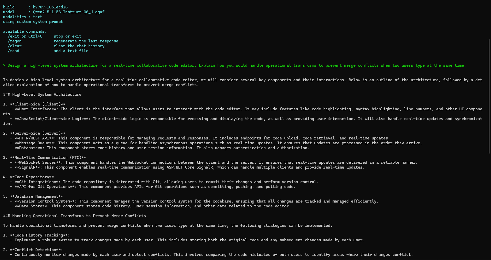

#  Lumina Edge
Lumina Edge is a lightweight execution framework designed to make **local Large Language Model (LLM) inference and development practical on low-RAM, consumer-grade hardware**.  

The objective is simple:

> **Run local LLMs as efficiently and reliably as possible.**

---

## Lumina Edge in Action

Below is a real execution of Lumina Edge running a quantized LLM on constrained hardware  
(**8GB RAM · Intel UHD 620 · Vulkan backend**):



---

##  System Requirements

### Software
- **Administrator privileges**
#### Setting up llama.cpp 
https://github.com/ggml-org/llama.cpp/releases
#### For IGPU: Download the llama.cpp Vulkan zip file.
#### For Nvdia: Download llama.cpp Cuda zip file.
 ** Extract the zip file into the: `C:\Lumina-Edge\bin` **

>  The core controller must be run **as Administrator** to allow temporary system optimization.
---
### Hardware

#### Integrated Graphics (Default)
- **RAM**
  - Minimum: 4GB  
  - Recommended: 8GB+
- **GPU**
  - Integrated GPU with **Vulkan 1.2+**
  - Intel UHD / Iris or AMD Radeon iGPU
- **Storage**
  - SSD strongly recommended

#### NVIDIA GPU (CUDA Variant)
- **RAM**
  - 8GB+ recommended
- **GPU**
  - NVIDIA GPU with CUDA support
- **Drivers**
  - Latest NVIDIA drivers installed
- **CUDA**
  - Automatically handled by llama.cpp CUDA builds
---

##  Project Layout
```text
C:\Lumina-Edge
├─ bin\        → llama.cpp binaries
├─ core\       → main controller (lumina-core.bat)
├─ scripts\    → system optimization (PowerShell)
├─ models\     → GGUF model (named "one")
├─ assets\     → screenshots and visuals
```
> The framework assumes the project is located at: **`C:\Lumina-Edge\`**
---

##  System Optimization (Important)

Before initializing the model, Lumina Edge performs a **temporary system optimization step**.

### What this does
- Frees unused RAM
- Reduces background service pressure
- Prepares memory for inference workloads

### What this does NOT do
- ❌ No permanent system changes  
- ❌ No registry edits  
- ❌ No services installed or removed  

The optimization script is located at: `C:\Lumina-Edge\scripts`

##  Model Setup (Critical)
### Instructions:
1. Download any GGUF model  
2. Place it inside the `models` directory  
3. Rename the file to: `one.gguf`

The controller automatically detects and loads any file named one.*.

##  Running Lumina Edge
### Run from Desktop
Copy lumina-core.bat to the Desktop (Recommended), or Create a shortcut to it
The script uses absolute paths, so it will work correctly from any location.
#### Always run as Administrator.

## Reference Performance  
*(8GB RAM · Intel UHD 620 · Vulkan)*

| Model Size | Quantization | Tokens / Second |
|-----------|--------------|-----------------|
| 1B        | Q8_0         | ~15 t/s         |
| 1.5B      | Q6_K         | ~9 t/s          |
| 7B        | Q4_K_M       | ~4-6 t/s        |

---
## Using Local LLMs for AI development

##  OpenAI-Compatible Local API 
**Run lumina-server.bat as Administrator**
Lumina Edge now supports running your local model as an **OpenAI-compatible API**, enabling:

* Programmatic access (Python, JS, etc.)
* Drop-in compatibility with OpenAI SDKs
* Local “chat mode” without a GUI
* Zero API keys or internet connection

This is powered by `llama.cpp`’s built-in server mode and exposed locally.

---

##  API Endpoint

When running, the local API is available at:

```text
http://127.0.0.1:1234/v1
```

This endpoint mirrors OpenAI’s `/v1` API structure.

---

##  Starting the API Server

1. Ensure your model is correctly set up:

   ```text
   C:\Lumina-Edge\models\one.gguf
   ```

2. Run the Lumina Edge controller **as Administrator**.

3. Wait for the confirmation message:

   ```text
   STAGE 2 :: STARTING API SERVER

   OpenAI-compatible endpoint:
     http://127.0.0.1:1234/v1
   ```

Once this appears, the server is live and blocking.

---

##  Verifying the Server (PowerShell)

PowerShell is the **recommended shell on Windows**.

### List Loaded Models

```powershell
Invoke-RestMethod http://localhost:1234/v1/models
```

Expected result includes:

```json
"model": "one.gguf"
```

If this returns status code **200**, the server is functioning correctly.

---

##  Chat Completions (PowerShell)

### Step 1 — Build the Request Body 

```powershell
$body = @{
    model = "one.gguf"
    messages = @(
        @{ role = "system"; content = "You are a helpful assistant." }
        @{ role = "user"; content = "Explain black holes simply." }
    )
} | ConvertTo-Json -Depth 5
```

### Step 2 — Send the Request

```powershell
Invoke-RestMethod `
    -Uri "http://localhost:1234/v1/chat/completions" `
    -Method POST `
    -ContentType "application/json" `
    -Body $body
```

The model response will be returned as JSON.

---

##  Python Client Usage

### Python Requirements

* Python **3.10+**
* Python must be added to `PATH`

### Install OpenAI Client

```powershell
python -m pip install openai
```

---

### Minimal Python Chat Example

Create a file called `chat.py`:

```python
from openai import OpenAI

client = OpenAI(
    base_url="http://localhost:1234/v1",
    api_key="none"
)

response = client.chat.completions.create(
    model="one.gguf",
    messages=[
        {"role": "system", "content": "You are a helpful assistant."},
        {"role": "user", "content": "Explain black holes simply."}
    ]
)

print(response.choices[0].message.content)
```

Run it:

```powershell
python chat.py
```

---

## What This Enables

Lumina Edge now supports:

* ✅ Local chat-based LLM usage
* ✅ OpenAI-compatible API
* ✅ PowerShell-native workflows
* ✅ Python SDK compatibility
* ✅ Low-RAM integrated GPU inference

No cloud.
No API keys.
No telemetry.

---


