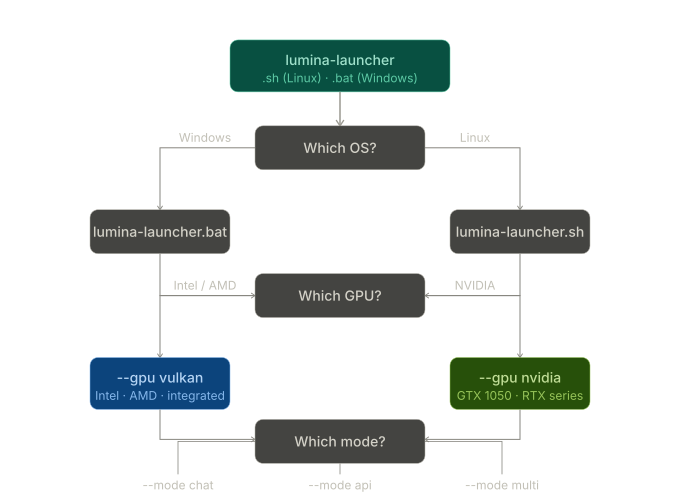
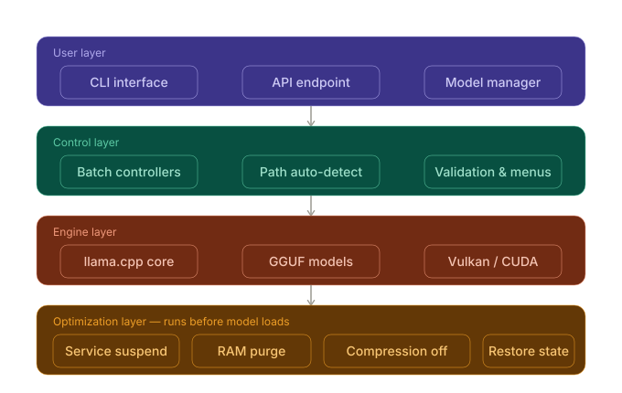
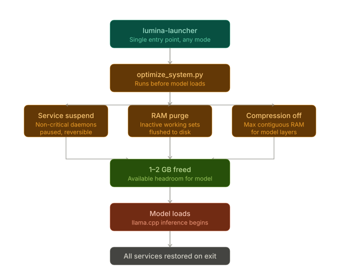
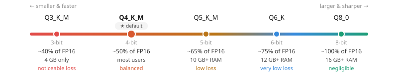

<div align="center">

# ⚡ Lumina Edge

### Run powerful AI models locally, On hardware you already own.

[](https://github.com/Parth-debug-cse/Lumina-Edge)
[](https://github.com/Parth-debug-cse/Lumina-Edge)
[](https://github.com/Parth-debug-cse/Lumina-Edge)
[](https://github.com/ggml-org/llama.cpp)
[](LICENSE)

<br/>

**[Get Started](#-quick-start) · [API Docs](#-openai-compatible-api) · [Roadmap](#-roadmap) · [Contributing](#-contributing)**

</div>

---

## The Problem with Local AI Today

You have a normal laptop. You want to run a local LLM — for privacy, for offline access, for zero API cost. The hardware is capable. The models exist. The tooling is the problem.

**Lumina Edge is built for that machine and that developer.** It uses `llama.cpp` — the fastest open-source inference engine available — with OS-level memory reclamation that frees 1–2 GB before inference begins. The result is a fully operational local LLM with an OpenAI-compatible API endpoint, to use the model in any project without worrying about api credits

---

## System Requirements

| Component | Minimum | Recommended |
|-----------|---------|-------------|
| OS (Windows) | Windows 10 x64 (1909+) | Windows 11 x64 |
| OS (Linux) | Ubuntu 20.04 / Debian 11 | Ubuntu 24.04 LTS |
| RAM | 8 GB | 16 GB+ |
| Storage | 10 GB free | 20 GB+ NVMe SSD |

**Vulkan (Intel / AMD):** Install the Vulkan Runtime from [vulkan.lunarg.com](https://vulkan.lunarg.com) (Windows) or run `sudo apt install mesa-vulkan-drivers` (Linux).

**CUDA (NVIDIA):** Requires driver version 535+. Download from [nvidia.com/drivers](https://www.nvidia.com/Download/index.aspx). Compatible with GTX 1050 and all RTX series.

---

## Quick Start

### Step 1 — Get the llama.cpp binaries

Download and extract the release from [ggml-org/llama.cpp](https://github.com/ggml-org/llama.cpp/releases/latest) and extract **all files directly** into `Lumina-Edge/bin/`. Do not create subfolders.

| OS | Your GPU | File to download |
|----|----------|-----------------|
| Windows | Intel / AMD (integrated) | `llama-bXXX-bin-win-vulkan-x64.zip` |
| Windows | NVIDIA | `llama-bXXX-bin-win-cuda-cu12.x-x64.zip` |
| Linux | Intel / AMD (integrated) | `llama-bXXX-bin-ubuntu-vulkan-x64.tar.gz` |
| Linux | NVIDIA | `llama-bXXX-bin-ubuntu-x64-cuda.tar.gz` |

> **Linux:** After extracting, make scripts executable:
> ```bash
> chmod +x model-manager.sh core/*.sh scripts/*.sh
> ```

### Step 2 — Pick a model




Run `model-manager` on Windows or  on Linux to download your chosen model.

### Step 3 — Launch

<details open>
<summary><strong>Windows</strong> (run as administrator)</summary>

| Mode | Command |
|------|---------|
| Chat — Vulkan | `core\lumina-core.bat` |
| Chat — CUDA | `core\lumina-core-nvidia.bat` |
| API — Vulkan | `core\lumina-api.bat` |
| API — CUDA | `core\lumina-api-nvidia.bat` |
</details>

<details>
<summary><strong>Linux</strong></summary>

| Mode | Command |
|------|---------|
| Chat — Vulkan | `./core/lumina-core.sh` |
| Chat — CUDA | `./core/lumina-core-nvidia.sh` |
| API — Vulkan | `./core/lumina-api.sh` |
| API — CUDA | `./core/lumina-api-nvidia.sh` |
</details>

---

## Architecture



---

## How the Memory Optimization Works




---

## Why Lumina Edge Outperforms the Alternatives

| | LM Studio | Ollama | **Lumina Edge** |
|---|---|---|---|
| Baseline RAM| **400–700 MB** (Electron GUI) | **200–400 MB** (persistent daemon) | **~0 MB** (no background process) |
| Background Services  | ✅ Yes — always running | ✅ Yes — always running | ❌ No — launches only on demand |
| Available RAM (8 GB) | ~3.0 GB | ~3.2 GB | **~5.2 GB (+73%)** |
| Pre-inference Flush | ❌ No | ❌ No | **✅ Yes — 1–2 GB freed automatically** |
| Quantization control | Limited | Limited | **Full — any GGUF, any Q-level** |
| Tokens/sec  | Baseline | −5 to −12% vs baseline | **+37% to +23%  Respectively** |

*\*Tokens/sec  measured on Intel Core i5-8250U · 8 GB DDR4 · Mistral-7B Q4\_K\_M.*

---

## Core Capabilities

**OS-Level Memory Reclamation**
Before any model loads, Lumina Edge surgically frees 1–2 GB of RAM by suspending non-critical system daemons, flushing inactive process working sets, and disabling memory compression — all fully reversible, zero permanent changes. No other local inference tool does this.

**Cross-Platform, One Workflow**
Identical experience on Windows (`.bat`) and Linux (`.sh`). Same commands, same model manager, same API endpoint. Switching OS means changing one character in the command.

**Dynamic Model Manager**
Download, list, and delete quantized models with a numbered menu. No file renaming. No path editing. Any `.gguf` file dropped in `models/` is instantly available.

**OpenAI-Compatible Local API**
Spin up a fully OpenAI-compatible REST endpoint at `http://127.0.0.1:1234/v1`. Drop it into any existing codebase that uses the OpenAI SDK — change only the `base_url`. Full details in the [API section](#-openai-compatible-api) below.

---

## Benchmarks

### Intel Core i5-8250U · 8 GB DDR4 · Intel UHD 620 · Vulkan

| Model | Quantization | Speed | RAM Used | 
|-------|-------------|-------|----------|
| TinyLlama 1.1B | Q4\_K\_M | ~18 t/s | 2.1 GB |
| Phi-3-mini 3.8B | Q4\_K\_M | ~12 t/s | 3.4 GB | 
| Mistral-7B | Q4\_K\_M | ~5.8 t/s | 5.8 GB |
| Llama-3-8B | Q4\_K\_M | ~4.3 t/s | 6.2 GB |

### Gaming Laptop — Intel Core i7-11800H · 16 GB DDR4 · NVIDIA RTX 3060 · CUDA

| Model | Quantization | Speed | GPU Layers Offloaded |
|-------|-------------|-------|----------------------|
| Mistral-7B | Q4\_K\_M | ~15.2 t/s | 20 |
| Llama-3-8B  | Q4\_K\_M | ~12.8 t/s | 20 |
| Llama-3-13B | Q4\_K\_M | ~8.2 t/s | 20 |

---

## OpenAI-Compatible API

Lumina Edge's API mode solves a critical problem for developers: **you should not have to rewrite application code to switch between a cloud model and a local one.**

When you launch an API server, Lumina Edge exposes a REST endpoint at `http://127.0.0.1:1234/v1` that speaks the exact same protocol as OpenAI's API. This means any application already integrated with the OpenAI Python SDK, the Node.js SDK, or any HTTP client sending requests to `api.openai.com` can be redirected to a local model by changing a single line — the `base_url`.

This has three immediate practical benefits:

- **Development without cost.** Use a local model during development and testing. Swap to a cloud model for production with no code changes. 
- **Privacy-sensitive workloads.** Route confidential data — internal documents, medical records, proprietary codebases — through a local model that never touches the network.
- **Offline and air-gapped environments.** Deploy the same API-integrated application in environments without internet access. No conditional logic, no fallback paths — just a different `base_url`.

No authentication is required for local connections. The endpoint accepts standard `chat/completions` requests with `model`, `messages`, `temperature`, `max_tokens`, and `stream` parameters.

---

### Python

```python
from openai import OpenAI

client = OpenAI(
    base_url="http://localhost:1234/v1",
    api_key="not-needed"  # Required by the SDK but unused locally
)

response = client.chat.completions.create(
    model="mistral-7b-instruct-v0.2.Q4_K_M.gguf",
    messages=[
        {"role": "system", "content": "You are a senior systems engineer."},
        {"role": "user", "content": "Explain POSIX compliance simply."}
    ],
    temperature=0.3,
    max_tokens=600
)
print(response.choices[0].message.content)
```

This is identical to how you would call `gpt-4o` or `claude-3-5-sonnet` through the OpenAI SDK — only `base_url` and `model` differ. Swap those two values to move between local and cloud inference. Everything else stays the same.

### Streaming

For chat interfaces, code editors, or any UX where responses should appear token-by-token rather than arriving all at once:

```python
stream = client.chat.completions.create(
    model="mistral-7b-instruct-v0.2.Q4_K_M.gguf",
    messages=[{"role": "user", "content": "Write a shell script to monitor disk usage."}],
    stream=True
)

for chunk in stream:
    if chunk.choices[0].delta.content:
        print(chunk.choices[0].delta.content, end="", flush=True)
```

Streaming is supported natively — the same `stream=True` flag used with OpenAI works without modification.

### Node.js

For server-side JavaScript, tooling scripts, or any Node.js application using the official OpenAI SDK:

```javascript
import OpenAI from "openai";

const client = new OpenAI({
  baseURL: "http://localhost:1234/v1",
  apiKey: "not-needed"
});

const response = await client.chat.completions.create({
  model: "mistral-7b-instruct-v0.2.Q4_K_M.gguf",
  messages: [
    { role: "system", content: "You are a helpful assistant." },
    { role: "user", content: "Explain the difference between TCP and UDP." }
  ],
  temperature: 0.3,
  max_tokens: 500
});

console.log(response.choices[0].message.content);
```

### PowerShell

For Windows automation pipelines, DevOps scripts, or any environment where Python or Node.js are not present:

```powershell
$body = @{
    model    = "mistral-7b-instruct-v0.2.Q4_K_M.gguf"
    messages = @(
        @{ role = "system"; content = "You are a helpful assistant." }
        @{ role = "user";   content = "Explain what a race condition is." }
    )
    temperature = 0.3
    max_tokens  = 500
} | ConvertTo-Json -Depth 5

$r = Invoke-RestMethod -Uri "http://localhost:1234/v1/chat/completions" `
     -Method POST -ContentType "application/json" -Body $body

$r.choices[0].message.content
```

### cURL

For quick validation, shell scripting, or any language with an HTTP client:

```bash
curl http://localhost:1234/v1/chat/completions \
  -H "Content-Type: application/json" \
  -d '{
    "model": "mistral-7b-instruct-v0.2.Q4_K_M.gguf",
    "messages": [{"role": "user", "content": "What is a mutex?"}],
    "temperature": 0.3,
    "max_tokens": 400
  }'
```

---
## Quantization Guide

Think of quantization like image compression — a JPEG takes up less space than a RAW file
with barely noticeable quality loss at the right setting. Quantization does the same to AI
models: smaller file, less RAM needed, nearly identical output. Q4\_K\_M is the sweet spot.



> **Rule of thumb:** Model file size (GB) + 2 GB overhead must be less than your total RAM.
---

## Troubleshooting

<details>
<summary><strong>llama-cli / llama-server not found</strong></summary>

Extract the llama.cpp release archive directly into `Lumina-Edge/bin/`. The `.exe` (Windows) or ELF binaries (Linux) must sit at the top level of `bin/` alongside their `.dll` / `.so` files — not inside a subfolder.

On Linux, ensure executables have permission: `chmod +x bin/llama-*`
</details>

<details>
<summary><strong>No models appear in the selection list</strong></summary>

The launcher scans `models/*.gguf`. Run `model-manager.bat` / `./model-manager.sh` to download a model, or manually place any `.gguf` file in the `models/` directory. Files in other formats (`.safetensors`, `.bin`) will not appear.
</details>

<details>
<summary><strong>Optimization fails / Access denied</strong></summary>

On Windows: right-click the `.bat` file and choose **Run as administrator**. Without elevated privileges the optimization step silently skips, and less RAM will be available for the model.

On Linux: the scripts call `sudo` automatically. Ensure your user has sudo access.
</details>

<details>
<summary><strong>Vulkan initialization failed</strong></summary>

Install the Vulkan Runtime from [vulkan.lunarg.com](https://vulkan.lunarg.com), then update your GPU drivers. After installation, verify with: `vulkaninfo | grep "GPU id"`. A missing or outdated Vulkan runtime is the most common cause of this error on Windows laptops.
</details>

<details>
<summary><strong>CUDA not available</strong></summary>

Run `nvidia-smi` to confirm your GPU is detected. If it is, update drivers to 535+ and confirm you downloaded the CUDA build of llama.cpp (`cuda` in the filename), not the Vulkan build.
</details>

<details>
<summary><strong>Port 1234 already in use</strong></summary>

The API scripts detect this before launching and show a clear error. To resolve manually:

```bash
# Windows
netstat -ano | findstr ":1234"
taskkill /PID <PID> /F

# Linux
ss -tlnp | grep 1234
sudo kill -9 <PID>
```
</details>

<details>
<summary><strong>Out of memory / crash on model load</strong></summary>

Switch to a smaller model or lower quantization. Close RAM-heavy applications (browsers, Electron apps) before launching. Verify: model file size (GB) + 2 GB must be less than total RAM. On an 8 GB system, keep your model file under 6 GB.
</details>

<details>
<summary><strong>Services did not restore after session</strong></summary>

Run the restore script manually:

```powershell
# Windows
powershell -ExecutionPolicy Bypass -File "$env:TEMP\lumina_restore_services.ps1"

# Linux
bash /tmp/lumina_restore_services.sh
```

Alternatively, a full system reboot restores all services automatically.
</details>

---

## Roadmap

Lumina Edge is actively developed. The near-term roadmap is focused on expanding developer tooling, broadening hardware support, and building a sustainable ecosystem around on-device inference.

### v1.1 — Developer Tooling *(In Progress)*
- [ ] `config.json` for persistent hyperparameter settings (threads, context size, GPU layers, temperature)
- [ ] `--benchmark` flag for automated tokens/sec and memory profiling across loaded models
- [ ] Structured JSON output mode for agent / tool-use pipelines

### v1.2 — Interface Expansion
- [ ] Electron / React web UI — browser-based chat and model management
- [ ] Model tagging and search inside the model manager
- [ ] Session history export (JSON / Markdown)

### v2.0 — Ecosystem
- [ ] Plugin architecture for custom backends (DirectML, OpenCL, ROCm)
- [ ] Multi-model parallel loading and routing
- [ ] HuggingFace multi-file shard support
- [ ] Python SDK wrapper for programmatic lifecycle control

> Want to accelerate a specific item? See [Contributing](#-contributing) or open a discussion.

---

## Contributing

We welcome contributions! To get started, check the roadmap and pick a feature or update to develop.

```bash
# Fork → branch → commit → PR
git checkout -b feature/your-feature
git commit -m "Add: your feature description"
# Open a Pull Request against main
```

When reporting bugs, include your OS version, full hardware specs (CPU, RAM, GPU), the complete error message, and exact reproduction steps.

---

## Acknowledgements

- **[llama.cpp — Georgi Gerganov](https://github.com/ggml-org/llama.cpp)** — The C/C++ inference backbone that powers everything.
- **[TheBloke — HuggingFace](https://huggingface.co/TheBloke)** — The default model repository.
- **[LunarG](https://www.lunarg.com)** — Vulkan SDK and runtime tooling.
- **[NVIDIA CUDA Toolkit](https://developer.nvidia.com/cuda-toolkit)** — GPU acceleration platform.

<div align="center">

Built by [Parth-debug-cse](https://github.com/Parth-debug-cse)
</div>